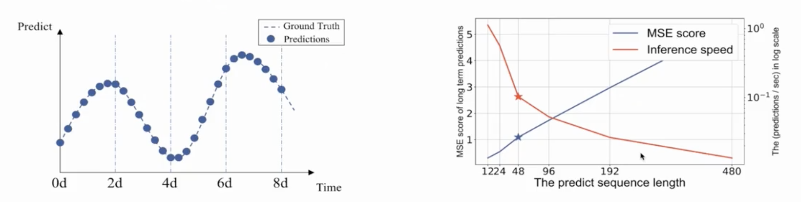

# Informer: Beyond Efficient Transformer for Long Sequence Time-Series Forecasting

## Overview

### Why we need long sequence
1. Sequence prediction is a problem that involves using historical sequence information to predict the next value or vlues in the sequence. It is a basic but important research problem.

### Problems in long sequence prediction
2. As the length of the data sequence increases, the inference speed of LSTM decreases repaidly and result in the inability to predict long sequences with limited computing power and time successfully. Meanwhile, the continuous accumulation of error causes the MSE score to increase rapidly, making the rusult unusable.

### The challenges when we use transfromers in long sequence prediction

1. The quadratic computation of self-attention.

2. the memory bottle nect in stacking layers.

3. the spped plunge in prediction long outputs.

### Improve in Informer（solve the challenges metioned before）

1. Self-attention mechanism

2. Self-attention Distilling Operation

3. Generative-style Decoder

## Discussion
1. Why we use transformers in LSTF?
2. Why MSE score to increase rapidly when the sequeences increase?

## Resource Links

https://github.com/zhouhaoyi/Informer2020

## Video Recording

## Code Demo

https://colab.research.google.com/drive/1_X7O2BkFLvqyCdZzDZvV2MB0aAvYALLC

