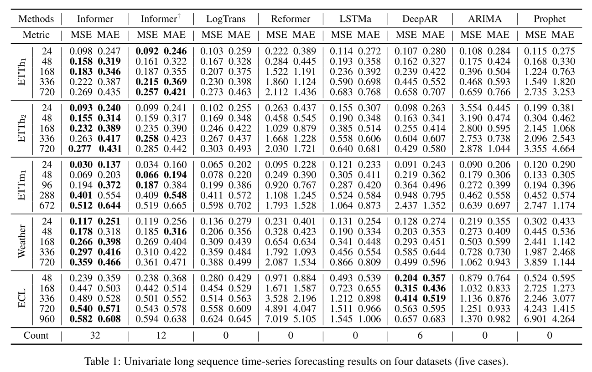
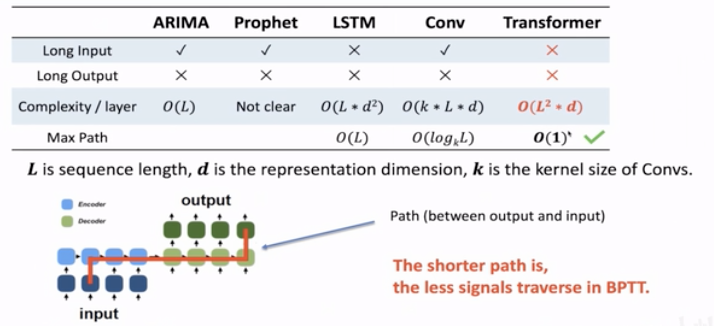

# Informer: Beyond Efficient Transformer for Long Sequence Time-Series Forecasting

## Overview

### Why we need long sequence
1. Sequence prediction is a problem that involves using historical sequence information to predict the next value or vlues in the sequence. It is a basic but important research problem.

### Problems in long sequence prediction
2. As the length of the data sequence increases, the inference speed of LSTM decreases repaidly and result in the inability to predict long sequences with limited computing power and time successfully. Meanwhile, the continuous accumulation of error causes the MSE score to increase rapidly, making the rusult unusable.

### The challenges when we use transfromers in long sequence prediction

1. The quadratic computation of self-attention.(Complexity)

   The atom operation of self-attention mechanism, namely conoimcal dot-product, causes the time complexity and memory usage per layer to be O(L^2)

2. the memory bottleneck in stacking layers.(Long Iutput)

   The stack of J encoder/decoder layer makes total memory usage to be O(j·L^2), which limits the model scalability on receiving long sequence inputs.
   

3. the speed plunge in prediction long outputs.(Long Output)

   The dynamic decoding of vanilla Transformer makes the inference spped as slow as RNN-based model.

### Improve in Informer（solve the challenges metioned before）

1. Self-attention mechanism

2. Self-attention Distilling Operation

3. Generative-style Decoder

   1)Start token is an efficient technique in NLP "dynamic decoding", especially for per-training model, and we extend it into a generative way.
   
   2)Insted of choosing a specific flag as the token, we sample a "shorter" long sequence in input sequence, which is an earlier slice before output sequence.
   
   3)For example, if we could like to predict 480 pionts(5-day predict in the ETT dataset), we will take the known 5 days before this time sequence as "start-token" and feed the generative-style inference decode with them.
   
   
### Experiments 

## Critical Thinking

In addition to the ProbSparse self-attnetion proposed by the author, the author can also try to apply Logsparse self-attnetion to the transformer to compare the performance changes.

## Discussion
1. Why we use transformers in LSTF?

3. What are advantages and disadvantages  of Sparse self-attnetion with self-attention?

Advantages: Sparse attention reduces computation time and the memory requirements of the attention mechanism by computing a limited selection of similarity scores from a sequence rather than all possible pairs, resulting in a sparse matrix rather than a full matrix. It could be fast and more space-efficient.

Disadvantages:  (1) They require efficient sparse-matrix multiplication operations, which are not available on all accelerators; (2) they usually do not provide rigorous theoretical guarantees for their representation power; (3) they are optimized primarily for Transformer models and generative pre-training; and (4) they usually stack more attention layers to compensate for sparse representations, making them difficult to use with other pre-trained models, thus requiring retraining and significant energy consumption. 

5. What is the next step for informer?

## Resource Links

https://github.com/zhouhaoyi/Informer2020

## Video Recording

## Code Demo

https://colab.research.google.com/drive/1_X7O2BkFLvqyCdZzDZvV2MB0aAvYALLC

